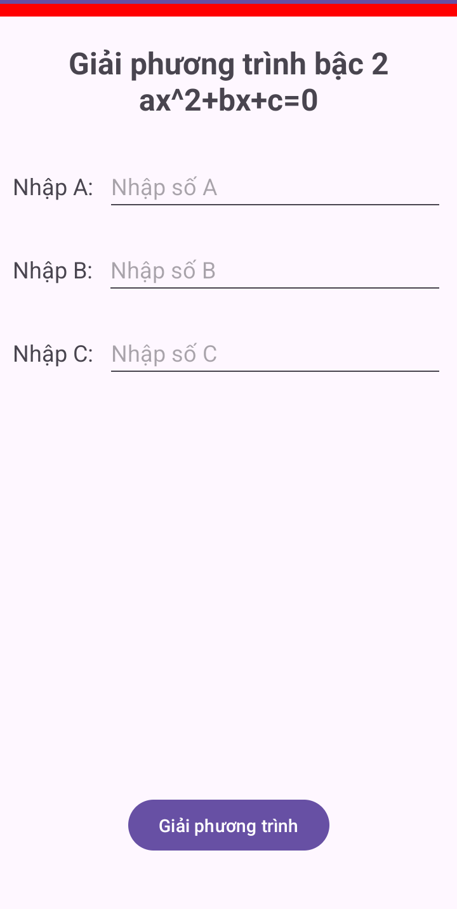
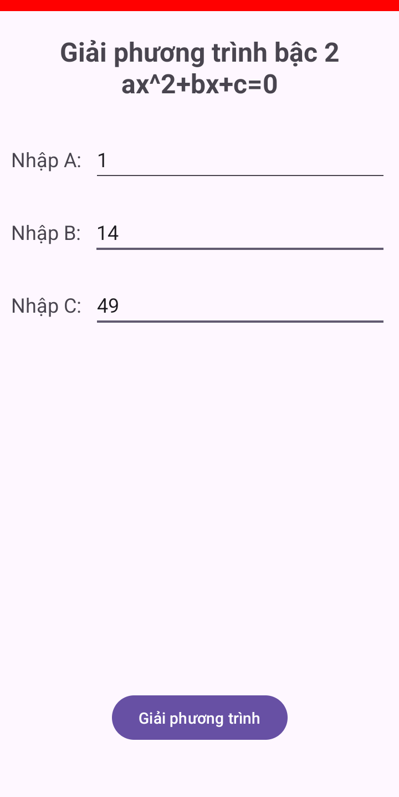
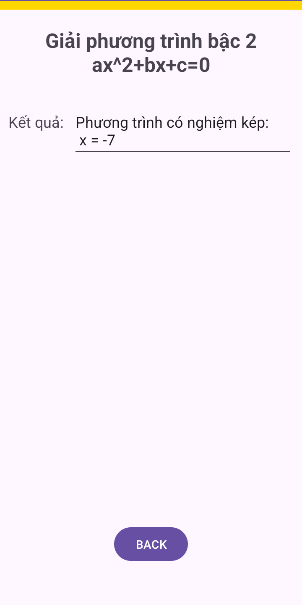
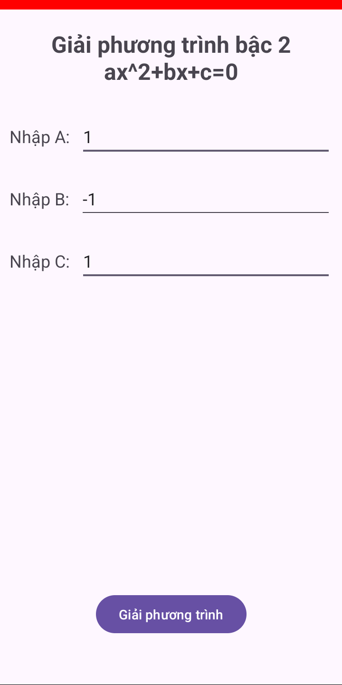
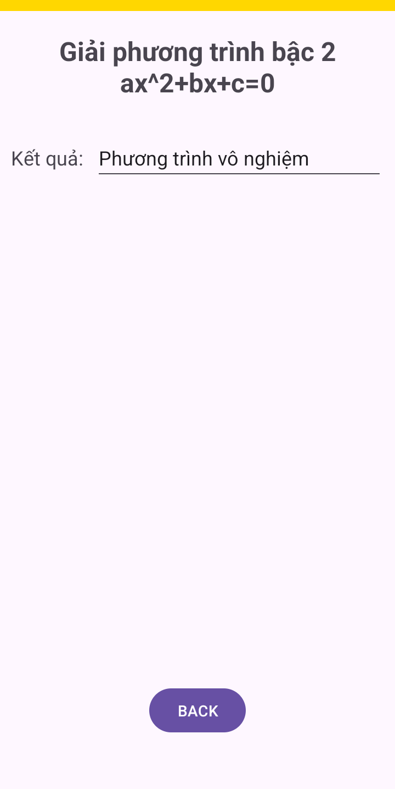

# Ứng dụng Giải Phương Trình Bậc 2

Ứng dụng Android đơn giản giúp người dùng giải phương trình bậc 2 dạng ax² + bx + c = 0 với giao diện trực quan và dễ sử dụng.

## Mô tả

Ứng dụng "Giải Phương Trình Bậc 2" được phát triển nhằm cung cấp một công cụ tiện lợi cho việc giải phương trình bậc 2 trên thiết bị di động. Người dùng chỉ cần nhập các hệ số a, b, c của phương trình và ứng dụng sẽ tự động tính toán, hiển thị kết quả theo 3 trường hợp:

- Phương trình có 2 nghiệm phân biệt (Δ > 0)
- Phương trình có nghiệm kép (Δ = 0)
- Phương trình vô nghiệm (Δ < 0)

Ứng dụng sử dụng kiến thức về vòng đời Activity, Intent và Bundle để truyền dữ liệu giữa các màn hình, đảm bảo trải nghiệm người dùng mượt mà và hiệu quả.

## Tính năng chính

- Giao diện đơn giản, dễ sử dụng
- Nhập hệ số a, b, c của phương trình bậc 2
- Kiểm tra và xác thực dữ liệu đầu vào
- Hiển thị kết quả chi tiết cho từng trường hợp
- Chuyển đổi mượt mà giữa các màn hình

## Hình ảnh minh họa

### Màn hình chính

### Trường hợp 1: Phương trình có 2 nghiệm phân biệt

| Màn hình nhập | Màn hình kết quả |
|:-------------:|:----------------:|
|  |  |

### Trường hợp 2: Phương trình có nghiệm kép

| Màn hình nhập | Màn hình kết quả |
|:-------------:|:----------------:|
|  |  |

### Trường hợp 3: Phương trình vô nghiệm

| Màn hình nhập | Màn hình kết quả |
|:-------------:|:----------------:|
|  |  |

## Cấu trúc ứng dụng

Ứng dụng bao gồm hai màn hình chính:

1. **MainActivity**: Màn hình nhập các hệ số a, b, c của phương trình
2. **SecondActivity**: Màn hình hiển thị kết quả giải phương trình

## Yêu cầu hệ thống

- Android 14.0 (API level 34 - "UpsideDownCake")
- Android Studio

## Cách cài đặt

1. Clone repository này về máy local
2. Mở dự án bằng Android Studio
3. Sync Gradle và build project
4. Chạy ứng dụng trên thiết bị thật hoặc máy ảo

## Công nghệ sử dụng

- Java
- Android SDK
- ConstraintLayout
- Activity Lifecycle
- Intent và Bundle

## Giấy phép

Dự án được phân phối dưới giấy phép MIT. Xem file `LICENSE` để biết thêm chi tiết.

## Tác giả

© 2025 - Được phát triển bởi Eggpant203 🍆

---

_Lưu ý: Đây là dự án học tập, mọi đóng góp và phản hồi đều được chào đón._